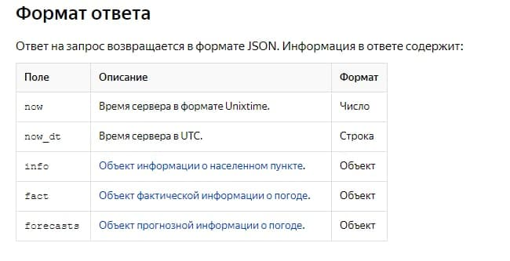

# Лабораторная работа №7
## API (Application programming interface)
---

Для своей программы я выбрала тему погоды,потому что это очень полезная тема,для пользователя и наиболее понятная для развития. API Яндекс.Погоды позволяет получать погодные данные в автоматизированном режиме. У яндекса есть отдельный сайт с документациями ,на котором очень подробно описываетсся работа с api сервисов яндекса.

## API Яндекс.Погоды

Рассмортрим формат запросов

Населенный пункт указывается при помощи значений широты (параметр lat) и долготы (параметр lon). Если данные параметры заданы некорректно, ответ будет содержать код ошибки 404.

```
GET https://api.weather.yandex.ru/v2/forecast?
 lat=<широта>
 & lon=<долгота>
 & [lang=<язык ответа>]
 & [limit=<срок прогноза>]
 & [hours=<наличие почасового прогноза>]
 & [extra=<подробный прогноз осадков>]

X-Yandex-API-Key: <значение ключа>
```


как мы видим из формата на вход нам требуются наши геоданные,честно я не думаю, что хоть кто-то знает широту города где он живет, значит воспользуемся ещё одним сервисом яндекса :) (Яндекс.Локатор API)


---

## API Яндекс.Локатор

тут немного сложнее, в качестве информации для запроса идут разные способы:
Локатор обработает данные из запроса в следующей последовательности:
Точки доступа Wi-Fi,
Сигналы сетей мобильной связи,
IP-адрес.
Если Локатор успешно определит местоположение, он вернет ответ с координатами точки и радиусом погрешности. В противном случае вы получите сообщение об ошибке.

Чтобы получить ответ о местоположении мобильного устройства, отправьте POST-запрос к ресурсу geolocation. Передайте данные в формате JSON.Сначала обязательное поле common,содержащее метаданные запроса(ключ и версию локатора),а далее данные по одному из трех вышеописанных путей.

о мне кажется самым удобным это определение по ip, потому что в графе о нём написано,что если поле пусто или заполнено неверно, то берется ip компьютера с которого запускается программа. Этим мы и воспользуемся при запросе.

получим мы ответ такого вида:
```
{ 
  "position": {
    "latitude": 55.743675,
    "longitude": 37.5646301,
    "altitude": 0.0, 
    "precision": 701.71643,
    "altitude_precision": 30.0, 
    "type": "gsm"
  }
} 
```
Ключи
(в нёмописаны как раз широта, долгота,высота над морем и различное выражение погрешности определеня)

из которого очевидно можно вычленить наши геоданные.


---

вернемся к запросу в первом сервисе,мы можем собрать ссылку для запроса и получить ответ с такими ключевыми элементами




в итоге из информации можно создать ответы на разного вида запросы и показывать всё удобно итоговой программе получая инфу из json, как изобычного словаря.

## Rак на деле сделать запросы get и post

для этого обратилась [суды](https://pythonru.com/biblioteki/kratkoe-rukovodstvo-po-biblioteke-python-requests "Я ccылка")

Если прочитать это руководство по работе с библеотекой request, уже можно найти всё, что нам нужно знать.
Вот пример запроса post с передачей json:
```
>>> payload = {'key1': 'value1', 'key2': 'value2'}
>>> r = requests.post("https://httpbin.org/post", data=payload)
```

в этом виде компилятор брыкался, поэтому мы попробовали закодированные JSON POST/PATCH данные:
```import json

url = 'https://api.github.com/some/endpoint'  
payload = {'some': 'data'}  
r = requests.post(url, data=json.dumps(payload))  
```
и этотоже не работало,тут дальше оказался совсем не понятный для меня момент, почему именно так надо,но методом гадания на кофейной гуще,я изменила так,что оно зароботало :) и вот итог:

```
payload = {"common": {"version": "1.0", "api_key": "AKhDTU4BAAAALIEZdwIA8WRlp3AZsFmko8SDuyABP6G5604AAAAAAAAAAACccbB3UybCt1wYmD65DkbyQGLF9A=="}, "ip": {"address_v4": ""}}
url_loc = 'http://api.lbs.yandex.net/geolocation'

r1 = requests.post(url_loc, data={'json': json.dumps(payload)})
```
>этот запрос мы используем для получения геоданных
```
position = r1.json()['position']
lat = position['latitude']
lon = position['longitude']
```

Вот пример запроса, с заголовком(в документации API описано, что ключ должен передаваться как header):

```
url = 'https://api.github.com/some/endpoint'  
headers = {'user-agent': 'my-app/0.0.1'}  
r = requests.get(url, headers=headers)
```

>этот запрос мы используем для получения метеорологических данных

вот, что получается в итоге:

```
url = 'https://api.weather.yandex.ru/v2/forecast?lat={lat}&lon={lon}&lang=ru_RU&extra=true'
url = url.format(lat=lat, lon=lon)

headers = {'X-Yandex-API-Key': 'db8a102e-a997-47da-a393-637938d3f66c'}

r = requests.get(url, headers=headers)
```
дальше дело за красотой) и использовании полученных данных. Целикомкод выглядитвот так:

```
import json
import requests

payload = {"common": {"version": "1.0", "api_key": "AKhDTU4BAAAALIEZdwIA8WRlp3AZsFmko8SDuyABP6G5604AAAAAAAAAAACccbB3UybCt1wYmD65DkbyQGLF9A=="}, "ip": {"address_v4": ""}}
url_loc = 'http://api.lbs.yandex.net/geolocation'

r1 = requests.post(url_loc, data={'json': json.dumps(payload)})

position = r1.json()['position']
lat = str(position['latitude'])
lon = str(position['longitude'])


url = 'https://api.weather.yandex.ru/v2/forecast?lat={lat}&lon={lon}&lang=ru_RU&extra=true'
url = url.format(lat=lat, lon=lon)
headers = {'X-Yandex-API-Key': 'db8a102e-a997-47da-a393-637938d3f66c'}

r = requests.get(url, headers=headers)
print("Программа для получения метеорологической информации о вашем населенном пункте!\nвыбрете функцию:\ninfo(информация о населенном пункте)\nfact(факты о погоде)\nexit(выход)")
while True:
    inp = input()
    if inp == 'info':
        url = r.json()['info']['url']
        name = r.json()['info']['tzinfo']['name']
        message = "часовой пояс для населенного пункта {name},подробнее о населенном пункте на {url}"
        message = message.format(name=name, url=url)
        print(message)

    if inp == 'fact':
        message = "Температура в населенном пункте {temp} градусов, но ощущается как {tempfl}. На улице {condition}, скорость ветра {wind}"
        temp = r.json()['fact']['temp']
        tempfl = r.json()['fact']['feels_like']
        condition = r.json()['fact']['condition']
        wind = r.json()['fact']['wind_speed']
        message = message.format(temp=temp, tempfl=tempfl, condition=condition, wind=wind)
        print(message)
    if inp == 'exit':
        print("спасибо за ваше время")
        break

```
Вывод:
```
U:\Margo\python>python лаб7.py                                                                                                                   
Программа для получения метеорологической информации о вашем населенном пункте!                                                                  
выбрете функцию:                                                                                                                                 
info(информация о населенном пункте)                                                                                                             
fact(факты о погоде)                                                                                                                             
exit(выход)                                                                                                                                      
info                                                                                                                                             
часовой пояс для населенного пункта Europe/Moscow,подробнее о населенном пункте на https://yandex.ru/pogoda/10735?lat=55.83110046&lon=37.33019257
fact                                                                                                                                             
Температура в населенном пункте 15 градусов, но ощущается как 12. На улице clear, скорость ветра 2                                               
exit                                                                                                                                             
спасибо за ваше время    
```                                                                                    
>пояснение про то, где я взяла ключи,при работе с сервисами яндекса они предлагают зарегестрировать кабинет разработчика и заполнить анкету.После чего ты и получаешь ключ.Если бы я действительно была разработчиком,мне бы так же предложили связаться по почте, атак же предоставили графическое оформление для размещения на сайте.

## спасибо за внимание)