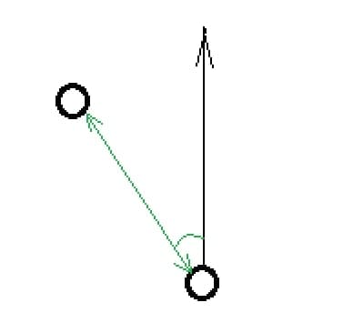
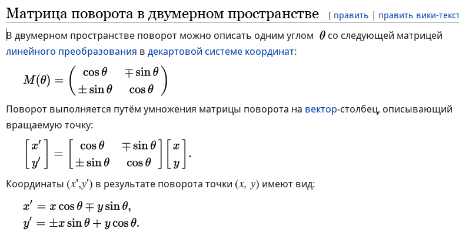
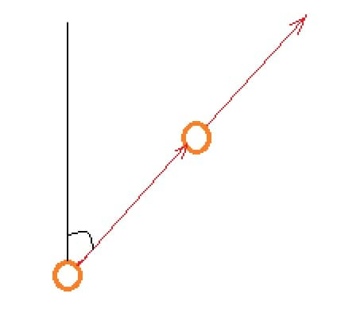
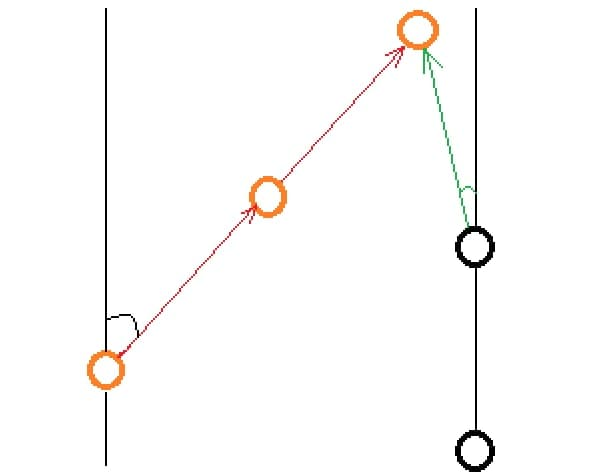

# Лабораторная работа №6
## или сага о подводном ориентировании 

>*Идет торговое судно. Рядом всплывает подводная лодка.*
>*Из открывшегося люка появляется пьяный подводник и кричит:*
>
> *- Эй кэп, где здесь Дарданеллы?*
>
> *- Зюйд-Зюйд-Вест держи.*
>
> *- Что ты мне зюзюкаешь, ты мне пальцем покажи.*

## Теория

Задумывались ли вы как военные подводые лодки попадают во вражеские?
так вот на нашей лодке система, расчитывающая балистику торпед и траекторию вражеских обьектов сломали :).

К счастью радар  работает и два раза с периодичностью ***в 10 секунд*** засекает расстояние до обьекта и угол от вектора направления движения нашей лодки. К тому же мы знаем скорость нашей лодки.(все скорости в задаче считать константами)

> зеленым обозначена информация, которую получает наша лодка при 'засекании'

| Формат ввода:  | Пояснение: 
| -------------  | ----------
| 60 4           | угол, расстояние(1ое засекание)
| 30 6,92           |   угол, расстояние(2ое засекание)
| 0,4              | скорость единиц в секунду

Что же нам делать этой информацей? Подсказкой по решению всей лабораторной станет исползование матрицы поворота:

> справку можно помотреть, нажав на картинку

---

## Задача №1

Первой задачей станет определение координат вражеской лодки ***(в абсолютной системе;(0;0)- точка, где наша лодка засекает первое положение вражеской, вертикальная ось совпадает с вектором направления нашей лодки)*** при первом и втором засекании.

| Формат вывода: | Пояснение: 
| -------------  | ----------  
| -3,46 2          | x y (1ое засекание)  
| -3,46 10     | x y (2ое засекание)  

---

## Задача №2

Определить угол наклона траектории вражеской лодки от вертикали и её скорость.

| Формат вывода: | Пояснение: 
| -------------  | ----------  
|  0         | угол
| 0,8           | скорость единиц на секунду

---

## Задача №3

При засекании третьего положения вражеской лодки что-то пошло не так, на нашей подлодке дана команда выпустить торпеду. Задача торпеды, имеющей скорость ***в два раза большую скорости нашей лодки***, попасть во врага, а ваша задача найти угол, под которым надо выпустить эту торпеду, и через сколько секунд снаряд попадет в цель.

>цель найти зелёный угол :)

| Формат вывода: | Пояснение: 
| -------------  | ----------  
| 10,37             | угол
| 2,25             | время до столкновения

## Удачных голодных игр :)
